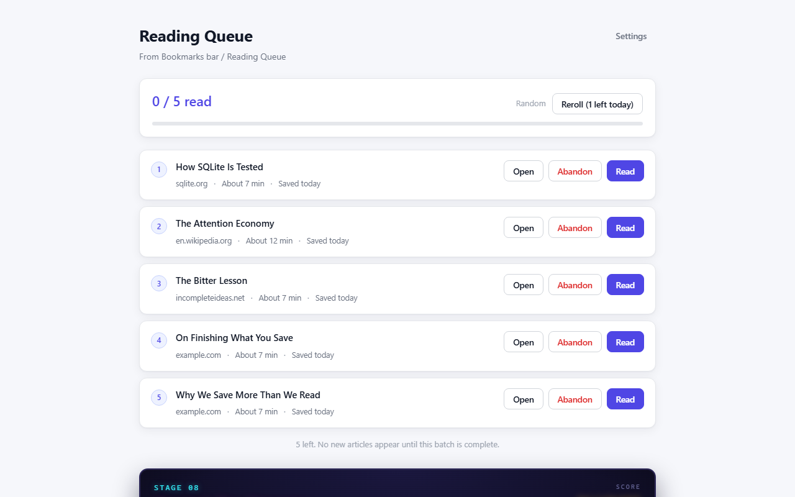
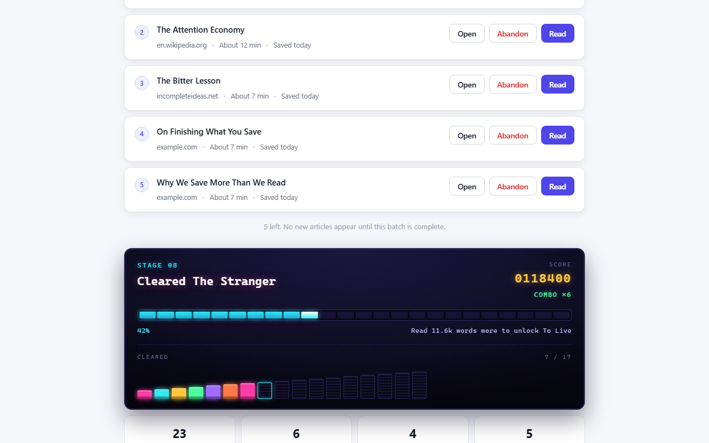

# Focus Reader

**English** · [简体中文](README.md)

Turn a Chrome bookmark folder into a reading queue you can actually finish.

Saving an article feels productive, but that small reward often replaces the
harder act of reading it. Focus Reader does not add another inbox, tag system, or
read-later service. It limits how many saved articles you can see at once.



## How it works

1. Choose one bookmark folder as your reading folder.
2. Click the extension icon to open the reading queue.
3. Draw a batch of 1–10 articles.
4. No new articles appear until the current batch is complete.
5. Each article has three actions:
   - **Open** — visit the original page.
   - **Read** — archive the bookmark and refresh its saved date.
   - **Abandon** — permanently delete it after a two-step confirmation.
6. The next batch unlocks when every article is handled.

> Saving remains unlimited. Only your field of attention is limited.

### Daily reroll

You may reroll the whole batch once per day. Once any article in the batch is
read or abandoned, the batch is committed and can no longer be rerolled.

## Arcade reading progress

Reading progress is presented like a 1990s arcade cabinet:

- **STAGE** — the book-equivalent milestone currently in progress.
- **SCORE** — estimated words read.
- **COMBO** — reading streak.
- **Energy meter** — progress toward the next milestone.
- **Pixel shelf** — 17 book slots, with completed stages illuminated.



## Source pages stay untouched

Open always navigates to the original bookmark URL. The extension does not read,
extract, inject into, or rewrite page content, and it requests no website access.

## Privacy

- No account, backend, analytics, advertising, or telemetry.
- Data stays in `chrome.storage.local`.
- No website permissions.
- Only `bookmarks` and `storage` permissions are requested.
- Bookmark URLs, titles, queue state, and reading progress are not transmitted.

See [PRIVACY.md](PRIVACY.md) for the complete bilingual policy.

## Selection methods

| Method | Behavior |
|---|---|
| Random | Rediscover forgotten saves |
| Oldest first | Clear the oldest bookmarks first |
| Source diversity | Rotate across domains |
| Balanced length | Mix quick reads with longer articles |

## Development

```bash
npm install
npm run build
npm test
npm run try
```

Load `dist/` through `chrome://extensions` with Developer mode enabled.

## Architecture

```text
src/
  background/    extension entry point and bookmark event handling
  reader/        locked reading queue
  options/       folder, batch size, and selection settings
  lib/           queue state machine, bookmarks, storage, i18n, and statistics
archive/
  focus-mode-v0.2.0/   removed reader-view implementation and restoration snapshot
```

The extension uses Chrome-native i18n with English as the default and Simplified
Chinese for `zh-CN` browsers.

## License

[MIT](LICENSE) © ericzhaouu
