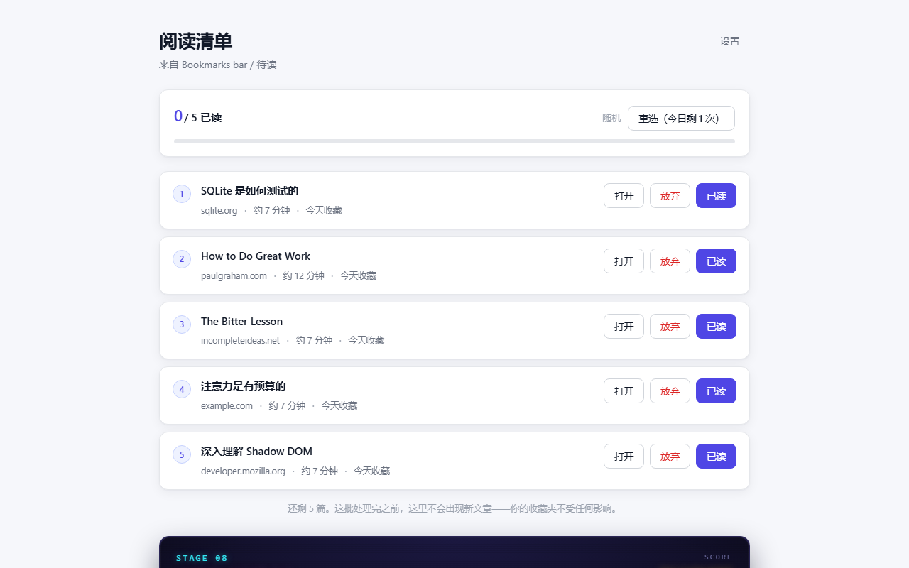
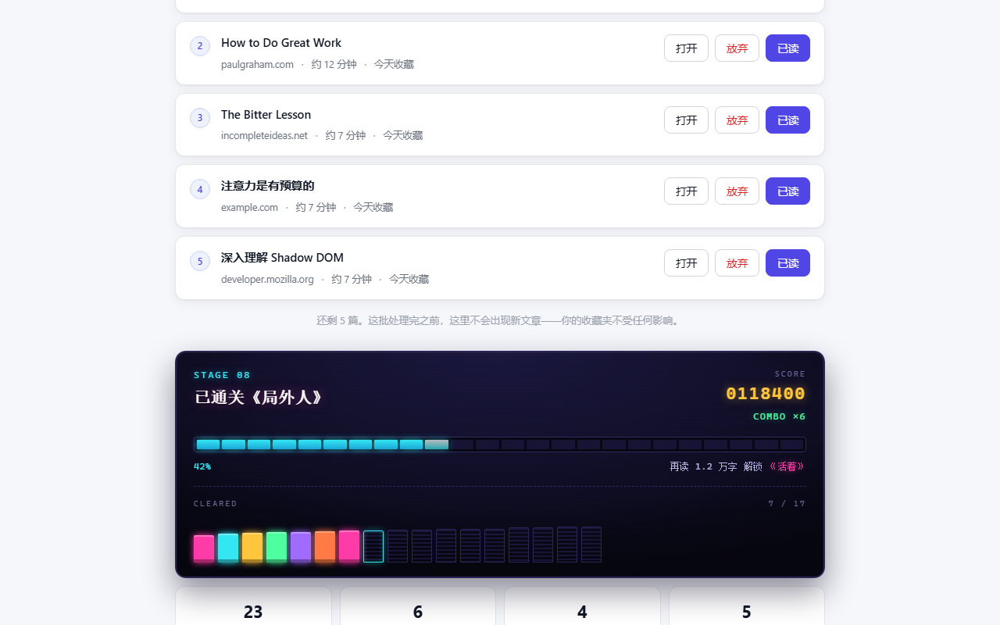

# Focus Reader — 读完再存

把 Chrome 收藏夹变成一份**读得完**的清单。

收藏一篇文章的那一刻，大脑会误以为自己已经读完了它。于是收藏夹越来越长，读过的却寥寥无几。
Focus Reader 不帮你收藏得更整齐——它限制你**一次能看到多少**。



## 它怎么工作

1. 指定收藏夹里的一个**待读文件夹**
2. 点击扩展图标，打开阅读清单
3. 插件从中抽出 N 篇（1–10，默认 10）并**锁定**
4. 清单上**没有任何新增入口**；整批重选**每天一次**，跨天恢复
5. 对每篇文章只有两个出口：
   - **已读** → 书签移入 `已读归档` 子文件夹，**收藏时间刷新为读完的当天**
   - **放弃** → 从收藏夹中彻底删除（不可撤销，需二次确认）
6. 整批清空后才解锁，可以抽下一批

> 你的收藏行为完全不受限制——照常无限收藏。受限的只是注意力的落点。

### 关于「重选」

每天可以整批重选一次。但**一旦你对这批里的任何一篇做了处理（已读或放弃），整批就不能再重选了**——
否则难啃的文章会被无限期地换掉。单篇不想读时用「放弃」，那才是正确的出口。

### 关于「已读」为什么要刷新收藏时间

Chrome 的 `bookmarks.update()` 不能修改 `dateAdded`，所以归档采用**先在归档夹新建、再删除原件**的方式，
新建的书签自然带上当天的时间戳。顺序上永远先建后删，任何一步失败都不会丢数据。
代价是书签 ID 会变化，因此批次里额外记录了 `archivedId`，自愈逻辑也改为按 URL 匹配。

## 读了多少：一台街机

跑步 App 会把公里数换算成「消耗了几碗米饭」，因为原始数字记不住，具象的对照记得住。
阅读同理——字数本身没有实感，「已通关《活着》」有。

清单底部是一块街机屏：书籍里程碑变成**关卡**，读书填充**能量槽**，
通关的书变成书架上的像素书脊留下来。



- **STAGE** — 当前正在攻打第几本
- **SCORE** — 累计字数，补零成街机分数
- **COMBO** — 连续阅读天数
- **能量槽** — 距离下一本还差多少，24 格 LED
- **书架** — 17 个槽位一次全部呈现，已通关的点亮，未解锁的留空

阶梯从「一篇长报道」（8 千字）一路到《战争与和平》（130 万字），走完会进入下一轮循环。
字数优先取专注模式解析出的**真实长度**；没走专注模式的文章按预估时长折算，保证进度条始终会动。

## 专注阅读模式

打开文章时，用 Readability 提取正文并就地渲染成无干扰的阅读视图：


- 文章在新标签页**正常打开**，保留登录态、Cookie 与 JS 渲染
- 阅读视图挂在 **Shadow DOM** 里，与站点样式互不污染
- 内容经 **DOMPurify** 净化后才插入
- 可调字号、行距、宽度与主题（浅色 / 深色 / 护眼）
- 读完点「已读」→ 归档 → 关页 → 焦点自动回到清单
- 提取失败或正文过短时**自动降级**保留原页，不会白屏

### 协作文档的虚拟滚动

飞书 / Lark 文档、Notion 这类编辑器会**虚拟化**长文档：只有视口附近的块存在于 DOM 中。
Readability 处理它们的非语义 div 其实没问题（实测全量渲染时约 98%），
真正的问题是它会在一份**被悄悄截断**的文档上"提取成功"——
看起来完整，实际只有一小部分。这比提取失败更糟。

所以在提取前会先识别虚拟滚动容器，走一遍滚动把所有块过一次 DOM 再采集，
按块 ID 去重、按文档位置排序。实测 80 块的文档：不做这一步只能拿到 13%，
做了之后 **80/80 完整恢复**，耗时约 0.6 秒，且页面自身的虚拟化行为不受破坏。

## 隐私

- **所有数据只存在本地**（`chrome.storage.local`），不上传到任何服务器
- 扩展没有后端，不含任何分析、追踪或遥测代码
- 安装时**不索取任何网页访问权限**
- `<all_urls>` 是**可选权限**，仅在你主动开启专注阅读模式时才弹窗申请；
  拒绝或事后撤销都不影响清单、归档与统计功能
- 网页正文只在你本地的浏览器内解析，用完即弃，不做任何存储或发送

| 权限 | 用途 |
|---|---|
| `bookmarks` | 读取待读文件夹；已读时把文章归档到子文件夹；放弃时删除该条收藏 |
| `storage` | 保存你的设置与当前批次 |
| `scripting` | 注入专注阅读视图 |
| `<all_urls>`（可选） | 让专注模式能读取当前页面的正文 |

## 开发

```bash
npm install
npm run build          # 类型检查 + 构建到 dist/
npm run dev            # 监听模式
npm run try            # 一键试用：独立临时配置 + 预置示例文章
npm run install:local  # 部署到固定位置，供日常使用
npm run update         # 拉取最新代码并重新部署
npm test               # 全部测试
npm run zip            # 打包成可分发的 zip
npm run release        # 构建 + 打包 + 发布 GitHub Release
npm run screenshots    # 生成 1280×800 截图到 store-assets/
```

### 一键试用

```bash
npm run try
```

会打开一个**可见的 Chrome 窗口**，使用系统临时目录里的独立配置——
你日常的 Chrome 配置与真实收藏夹完全不会被触碰。脚本会自动：

- 装好扩展，建一个含 15 篇文章的「待读」文件夹
- 本地起一个小服务器提供几篇长文（离线也能测专注模式），
  其中包含一篇正文极短的页面，用来验证降级行为
- 打开阅读清单页，等你手动点完再自动清理临时配置

关闭那个 Chrome 窗口即结束。

---

## 自己长期使用

```bash
npm run install:local
```

会构建并把扩展部署到一个**固定位置**（Windows 是
`%LOCALAPPDATA%\FocusReader\extension`），然后按提示在
`chrome://extensions` 里「加载已解压的扩展程序」选中该文件夹即可。

> ⚠ **不要直接加载仓库里的 `dist/`。**
> 非打包扩展的 ID 由**文件夹绝对路径**推导而来，而 `npm run build` 每次都会清空 `dist/`。
> 更要紧的是：一旦目录被移动或删除，Chrome 会认为这是个全新扩展，
> **阅读记录、统计、连续天数全部清零**。所以要装在一个不会动的地方。

以后想升级：

```bash
npm run update
```

会拉取最新代码、装依赖、构建、部署到同一个位置，最后提示你去
`chrome://extensions` 点该扩展的「**重新加载**」⟳（或者重启 Chrome）。

**Chrome 不会自动更新非打包扩展**——它只是从磁盘读文件，不会主动去看有没有新版本。
所以这一步必须手动触发。路径不变 → 扩展 ID 不变 → 阅读记录和统计全部保留。

**副作用**：开发者模式下 Chrome 每次启动会弹一次「请停用开发者模式扩展程序」的提醒。
点掉即可，不影响使用。

---

## 手动加载（开发用）

在 `chrome://extensions` 打开开发者模式 →「加载已解压的扩展程序」→ 选择 `dist/`。
仅用于开发调试；日常使用请走上面的 `npm run install:local`。

### 构建产物

两份 Vite 配置共用 `dist/`：

- `vite.config.ts` — 阅读页、设置页与 background service worker（ES module）
- `vite.content.config.ts` — 专注模式注入脚本，必须打成**自包含 IIFE**，
  因为 `chrome.scripting.executeScript` 只接受传统脚本

### 测试

| 命令 | 内容 |
|---|---|
| `npm run smoke` | 批次状态机（32 项），针对内存版 chrome API 模拟运行 |
| `npm run e2e` | 真实 Chrome + 真实书签，验证清单、锁定、归档与放弃（19 项） |
| `npm run e2e:focus` | 把真实构建产物注入真实页面，验证提取、隔离与工具栏（19 项） |
| `npm run e2e:virtual` | 虚拟滚动文档的完整恢复（飞书 / Notion 这类编辑器） |

端到端测试通过 CDP 驱动无头 Chrome，不依赖 puppeteer/playwright。
Chrome 137+ 已忽略 `--load-extension` 命令行参数，因此改用 CDP 的
`Extensions.loadUnpacked` 安装扩展。

### 目录结构

```
src/
  background/service-worker.ts   入口调度、tabId↔bookmarkId 映射、注入、书签事件校正
  reader/                        阅读清单页（React）
  options/                       设置页（React）
  focus/                         专注阅读模式：提取管线 + Shadow DOM 视图
  lib/
    batch.ts                     批次状态机（核心）
    bookmarks.ts                 书签读写与归档
    selection.ts                 选文策略引擎
    estimate.ts                  阅读时长预估与自校准
    storage.ts / types.ts        类型化存储
    messaging.ts / permissions.ts
```

## 选文策略

| 策略 | 说明 |
|---|---|
| 随机 | 默认。最省心，也最容易撞见被遗忘的收藏 |
| 最早收藏优先 | 先清理沉底的老收藏 |
| 来源多样 | 按域名轮流抽取，避免一整批来自同一站点 |
| 时长均衡 | 分层抽样，长短搭配 |

阅读时长起初由域名先验估算；文章真正被打开后，实测长度会回流校准该域名的估值。

---

## 许可

[MIT](LICENSE) © ericzhaouu
